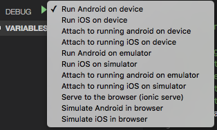

# Cordova Tools Extension

Debug your code, find commands in the Command Palette, and use IntelliSense to browse objects, functions, and parameters in plugin APIs. This extension works with any Cordova-based project.


## Install it

Click the **Get Started** button on this page.

You'll also have to do a few more things:

1. Open a Terminal (on a Mac) or a Command Prompt (on a Windows computer).
2. Run `npm install -g cordova`
3. If you're planning on targeting iOS devices, install [HomeBrew](http://brew.sh/) on our Mac.

    Then open a Terminal and run `brew install ideviceinstaller ios-webkit-debug-proxy`

## Make sure that your Cordova project has a platform

Your project needs at least one of them.

Just open a Terminal or a Command Prompt.

In the root directory of your project run: `cordova platform add android` or `cordova platform add ios`.

For now, only those two platforms are used by this extension.

## Choose the Cordova debug environment

Click the debug icon () in the View bar, and then click the configure gear icon () to choose the Cordova debug environment.


The launch configuration file appears. It contains some default configurations such as this one below.


You can modify these configurations or add new ones to the list. Just don't add a Windows or a Browser configuration. They're not supported yet.

You can use other fields in these configurations as well. Here's the complete list:

<style>
    table, th, td {
        border: 1px solid black;
        border-collapse: collapse;
    }
    th, td {
        padding: 5px;
    }
</style>
<table>
<tbody><tr>
  <th>
    <p><strong>Field</strong></p>
  </th>
  <th>
    <p><strong>Description</strong></p>
  </th>
  <th>
    <p><strong>Default value</strong></p>
  </th>
</tr>
 <tr>
   <td><strong>port</strong></td><td>The port number that the debugger uses to connect to a device or emulator. </td><td>9222</td>
 </tr>
 <tr>
   <td><strong>sourceMaps</strong></td><td>Set this field to ```true``` if you want the debugger to use JavaScript sourcemaps (if they exist).  </td><td>false</td>
 </tr>
 <tr>
   <td><strong>webkitRangeMin, webkitRangeMax:</strong></td><td>Specifies the port range that you want the debugger to use to find the specific device or simulator that is described in the configuration. By default, the debugger uses the port range.</td><td>9223 - 9322</td>
 </tr>
 <tr>
   <td><strong>attachAttempts</strong></td><td>The maximum number of times that you want the debugger to make an attempt at attaching to a running iOS app.</td><td>5</td>
 </tr>
 <tr>
   <td><strong>attachDelay</strong></td><td>The time in milliseconds between each attempt to attach to a running iOS app. </td><td>1000</td>
 </tr>
 <tr>
   <td><strong>iosDebugProxyPort</strong></td><td>The port number that you want the debugger to use when it launches iOS applications on a device.</td><td>9221</td>
 </tr>
 <tr>
   <td><strong>appStepLaunchTimeout</strong></td><td>The maximum time in milliseconds that you want allow for each individual step that the debugger takes to launch an iOS app on a device.</td><td>5000</td>
 </tr>
</table>


## Debug your Cordova-based project

To start the debugger, choose a target from the target drop-down list, and then click the start button () or press F5.



You can debug your app on an Android emulator, iOS simulator, or a device. If you have your app running in one already, you can attach to it. The debugger uses the application ID of your project to locate the running instance.

We won't go into all of the great things that you can do with the Visual Studio Code debugger, but you can read about them [here](https://code.visualstudio.com/docs/editor/debugging).

> **Troubleshooting tip:**
If you receive an error stating that ADB is not recognized as an internal or external command, you'll have to update your path variable to include the location of your *ADB* executable file. The *ADB* executable file is located in a subfolder along with your other Android SDK files. For example, on a Windows computer, the location of the *ADB* executable file would likely be here: ```C:\Program Files (x86)\Android\android-sdk\platform-tools```.

## Find Cordova commands in the Command Palette

In the Command Palette, type ```Cordova``` and choose a command.


There's only a couple of them for now but that list will grow.

The **Build** command is equal to running ```cordova build``` from the Cordova command line. It builds for *all* platforms that you've added to the project and because of that, you might receive errors. Don't worry, in some cases, that's normal.

For example, if you're on a Windows computer, and you've added an iOS platform to your project, you'll get an error because you need a Mac to build for iOS platforms. You can't build an iOS app on a Mac by using VSCode on a Windows computer.

The ```Run``` command starts your app without debugging. It's equal to running ```cordova run``` from the Cordova command line, and just like the **Build** command, it runs *all* platforms that you've added to your project.

## Use IntelliSense with Plugin API's

Intellisense helps you discover objects, functions, and parameters in libraries that your project consumes. Now you can use it for the more popularly used *core* plugins.


IntelliSense appears only for plugins that you've added to your project, but it doesn't matter whether you add the plugin before or after you install this extension.

Just start typing in the code editor to see the objects, functions, and parameters of your plugin's API.
