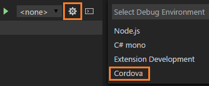
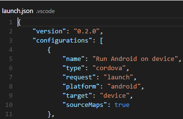
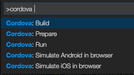

# Cordova Tools Extension

Debug your code, find commands in the Command Palette, and use IntelliSense to browse objects, functions, and parameters in plugin APIs. This extension works with any Cordova-based project.


## Install it

Click the **Get Started** button on this page.

You'll also have to do a few more things:

1. Open a Terminal (on a Mac) or a Command Prompt (on a Windows computer).
2. Run `npm install -g cordova`
3. If you're planning on targeting iOS devices,
 * Install [HomeBrew](http://brew.sh/) on your Mac.
 * Open a Terminal and run `brew install ideviceinstaller ios-webkit-debug-proxy`

## Add a platform to your Cordova project

Open a Terminal or a Command Prompt and run the following command in the root directory of your project

`cordova platform add android`

Supported platforms: `android, ios`

## Choose the Cordova debug environment

Click the debug icon () in the View bar, and then click the configure gear icon () to choose the Cordova debug environment.



The launch configuration file appears. It contains some default configurations such as what is shown below.



You can modify these configurations or add new ones to the list. Just don't add a Windows or a Browser configuration as they are not supported yet.

You can use other fields in these configurations as well. Here's the complete list:


* `port`: The port number that the debugger uses to connect to a device or emulator. The default is 9222.
* `sourceMaps`: Set this field to `true` if you want the debugger to use javascript sourcemaps (if they exist). The default is false.
* `webkitRangeMin`, `webkitRangeMax`: Combines to specify the port range that you want the debugger to use to find the specific device or simulator described in the configuration. The defaults are 9223 and 9322.
* `attachAttempts`: The maximum number of times that you want the debugger to attempt to attach to a running iOS app. The default is 5.
* `attachDelay`: The time in milliseconds between each attempt to attach to a running iOS application. The default is 1000.
* `iosDeubgProxyPort`: The port number that you want the debugger to use when it launches iOS applications on a device. The default is 9221.
* `appStepLaunchTimeout`: The maximum time in milliseconds allowed for each individual step the debugger takes to launch an iOS app on a device. The default is 5000.


## Debug your Cordova-based project

To start the debugger, choose a target from the target drop-down list, and then either click the start button () or press F5.


You can debug your app on an Android emulator, iOS simulator, or a device. If you have your app running in one already, you can attach the debugger to it. The debugger uses the application ID of your project to locate the running instance.

We won't go into all of the great things that you can do with the Visual Studio Code debugger, but you can read about it [here](https://code.visualstudio.com/docs/editor/debugging).

> **Troubleshooting tip:**
If you receive an error stating that ADB is not recognized as an internal or external command, you'll have to update your path variable to include the location of your *ADB* executable file. The *ADB* executable file is located in a subfolder along with your other Android SDK files. For example, on a Windows computer, the location of the *ADB* executable file would likely be here: ```C:\Program Files (x86)\Android\android-sdk\platform-tools```.

## Find Cordova commands in the Command Palette

In the Command Palette, type ```Cordova``` and choose a command.



There are only a couple of them for now but that list will grow.

The **Build** command triggers ```cordova build``` and builds for all platforms that you've added to the project.

Since all platforms are built you may receive errors for incompatible configurations.
For example, if you're on a Windows computer, and you've added an iOS platform to your project, you'll get an error because you need a Mac to build for iOS platforms. You can't build an iOS app on a Mac by using VSCode on a Windows computer.

The ```Run``` command triggers `cordova run` and starts your app without debugging and just like the **Build** command, it runs *all* platforms that you've added to your project.

## Use IntelliSense with Plugin APIs

Intellisense helps you discover objects, functions, and parameters in libraries that your project consumes. Now you can use it for the more popularly used *core* plugins.


IntelliSense appears only for plugins that you've added to your project, but it doesn't matter whether you add the plugin before or after you install this extension.

Just start typing in the code editor to see the objects, functions, and parameters of your plugin's API.

## How to disable telemetry reporting

VS Code Cordova extension collects usage data and sends it to Microsoft to help improve our products and services. Read our [privacy statement](https://www.visualstudio.com/en-us/dn948229) to learn more.

If you don’t wish to send usage data to Microsoft, please follow the instructions below to disable its collection.

Important Notice: You will need to apply these changes after every update to disable collection of usage data. These changes do not survive product updates.

### Windows

* Edit VSCodeTelemetrySettings.json file at %appdata%\vscode-cordova and add "optIn":false.

### OS X / Linux

* Edit VSCodeTelemetrySettings.json file at ~/.vscode-cordova and add "optIn":false.